# SB10-part4-5팀

[](https://codecov.io/gh/sb10-part4-team5/sb10-mopl-team5)

> 팀 협업 문서(Notion): https://orchid-science-d92.notion.site/SB-10-Part4-5-ad447b8a4b9983268f1c81692fa2480d?source=copy_link

<br>

## 팀원 구성

| 이름 | 담당 | GitHub |
| --- | --- | --- |
| 송시연 (팀장) | 프로필 관리, 팔로우/DM, 서비스 배포 | [dstle](https://github.com/dstle) |
| 김성경 | SSE, 알림, 콘텐츠 리뷰 | [conradrado](https://github.com/conradrado) |
| 김하은 | 인증/인가(JWT, OAuth), Admin | [shong9124](https://github.com/shong9124) |
| 이규빈 | 콘텐츠 관리, 외부 콘텐츠 수집 | [plzslp](https://github.com/plzslp) |
| 이윤섭 | 실시간 같이 보기, 플레이리스트 | [metDaisy](https://github.com/metDaisy) |

<br>

## 프로젝트 소개

- **모두의 플리(mopl)**: 관심 콘텐츠(영화, 스포츠 등)를 팔로우하고 플레이리스트로 공유하며, 실시간으로 함께 보고 알림을 주고받는 커뮤니티 서비스의 Spring 백엔드 시스템 구축
- 배포 주소: https://mopl-dev.site
- 프로젝트 기간: 2026.06.18 ~ 2026.07.29

<br>

## 기술 스택

| 영역 | 사용 기술 |
| --- | --- |
| 언어 / 프레임워크 | Java 17, Spring Boot 3.5 |
| 인증 / 인가 | Spring Security, OAuth2 Client, JWT (jjwt) |
| 영속성 / DB | Spring Data JPA, QueryDSL, PostgreSQL 17, Flyway |
| 캐시 | Redis (ElastiCache), Caffeine |
| 검색 | OpenSearch (nori) |
| 메시징 / 이벤트 | Apache Kafka (MSK), Spring Modulith Events, SSE, WebSocket |
| 배치 / 스케줄링 | Spring Batch, ShedLock (분산 락) |
| 매핑 | MapStruct, Lombok |
| 외부 연동 | WebClient (TMDB, SportsDB), AWS S3, JavaMail |
| API 문서 | springdoc-openapi (Swagger UI) |
| 모니터링 | Actuator, Micrometer + Prometheus, Grafana Cloud (Loki) |
| 인프라 / 배포 | AWS (ECS on EC2, ALB, RDS, MSK, OpenSearch, CloudFront, S3, Route 53), Docker, Terraform, GitHub Actions |
| 협업 | Git & GitHub, Discord, Notion |

<br>

## 문서

- [온보딩 가이드](docs/onboarding.md) — 사전 요구사항, 로컬 실행, 빌드, 테스트 가이드
- [백엔드 컨벤션](docs/backend-convention.md)
- [알림 이벤트 가이드](docs/notification-event-guide.md)

<br>

## 팀원별 구현 기능 상세

### 송시연 (팀장)

<details>
<summary>📷 스크린샷</summary>

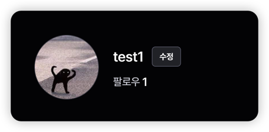<br/>
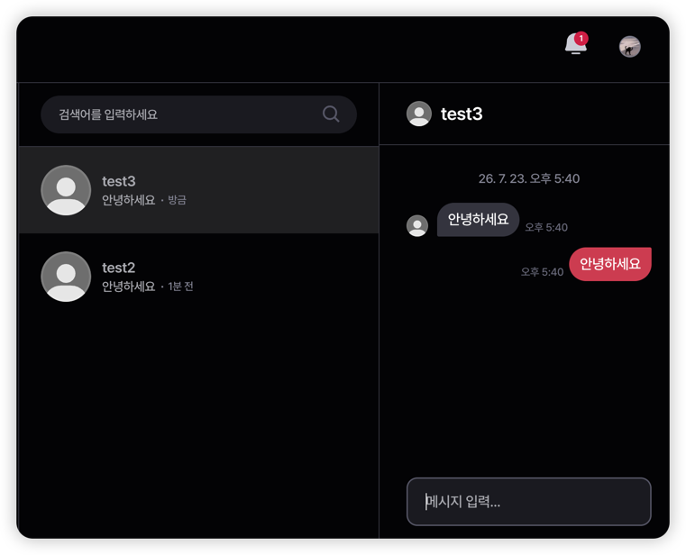<br/>

</details>

- **사용자 프로필 관리**
  - 프로필 조회 및 수정 API 구현 (멀티파트 요청으로 프로필 이미지 업로드, S3 저장)
- **팔로우**
  - 팔로우/언팔로우, 내가 팔로우한 목록, 팔로워/팔로잉 수 조회 API 구현
- **DM (다이렉트 메시지)**
  - 대화방 조회/생성, 메시지 읽음 처리 API 구현
  - 실시간 메시지 전달: 활성화된(접속 중) 대화는 STOMP(WebSocket), 비활성화된 대화는 SSE로 전송
- **서비스 배포 (인프라 전담)**
  - Terraform(IaC)으로 AWS 인프라 구성: VPC(2 AZ), ECS on EC2, ALB, RDS, ElastiCache, MSK, OpenSearch, CloudFront/S3, Route 53
  - GitHub Actions + OIDC 기반 CI/CD 파이프라인 구축 (ECR 푸시 → ECS 롤링 배포, 실패 시 자동 롤백)
  - 관측성 구성: Grafana Alloy → Grafana Cloud(Prometheus/Loki), 장애 시 스레드 덤프 자동 수집(Lambda)
  - SSM Parameter Store 기반 시크릿 관리

### 김성경

<details>
<summary>📷 스크린샷</summary>

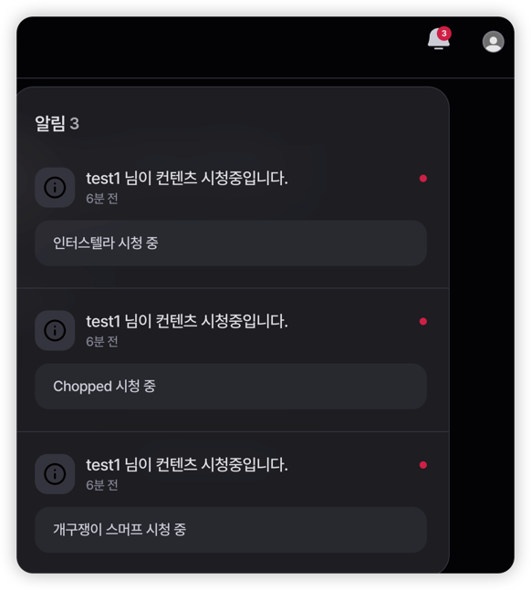<br/>
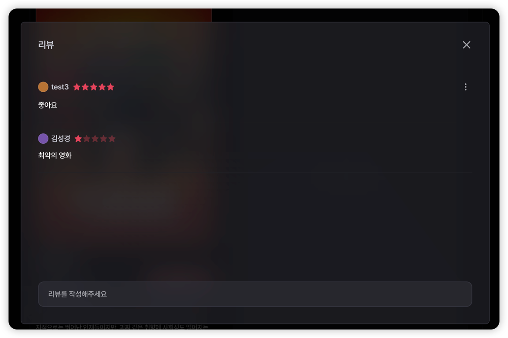<br/>
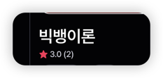<br/>

</details>

- **SSE (실시간 전송)**
  - `text/event-stream` 기반 SSE 구독 엔드포인트 및 Emitter 저장소 구현
  - 다중 인스턴스 환경에서 Kafka로 이벤트를 팬아웃 → 사용자가 어느 서버에 연결돼 있든 실시간 수신 (알림/DM 이벤트)
- **알림**
  - 알림 목록 조회(커서 페이지네이션), 읽음 처리 API 구현
  - 이벤트 발생 시 알림 생성 → Kafka → SSE로 실시간 전달 (Spring Modulith 이벤트 기반)
  - SSE 재연결 시 미수신 알림 복구 (Last-Event-ID 기반)
- **콘텐츠 리뷰**
  - 리뷰 생성/조회/수정/삭제(CRUD) API 구현

### 김하은

<details>
<summary>📷 스크린샷</summary>

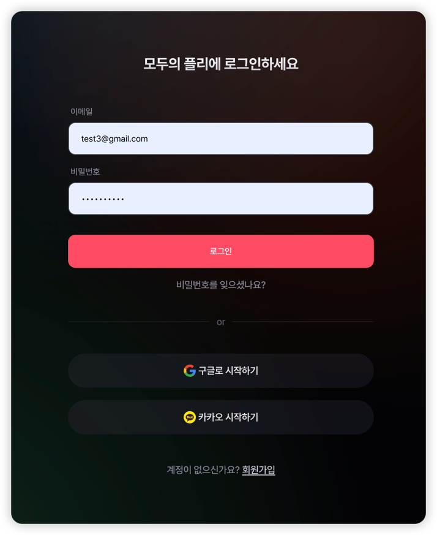<br/>
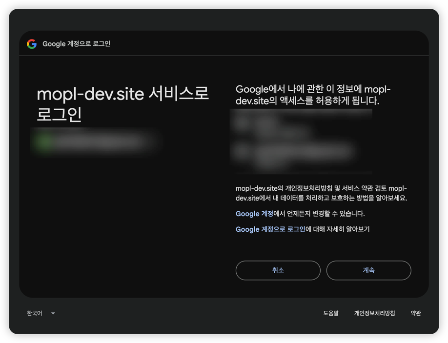<br/>
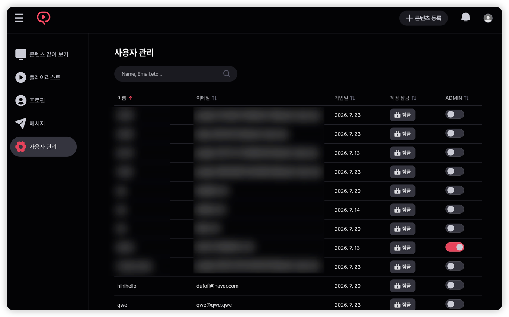<br/>

</details>

- **인증 / 인가**
  - Spring Security 기반 로그인(폼 로그인 + OAuth2 소셜 로그인)과 JWT 인증 필터 구현
  - Access/Refresh 토큰 발급 및 재발급(`/refresh`), 리프레시 토큰/로그인 세션 저장소 구현 (Redis + DB)
- **OAuth2 소셜 로그인**
  - Google, Kakao OAuth2 로그인 연동
- **비밀번호 재설정**
  - 임시 비밀번호 발급 및 메일 발송(`/reset-password`)
- **관리자(Admin)**
  - 사용자 권한(role) 변경, 계정 잠금(locked) 처리 API 구현

### 이규빈

<details>
<summary>📷 스크린샷</summary>

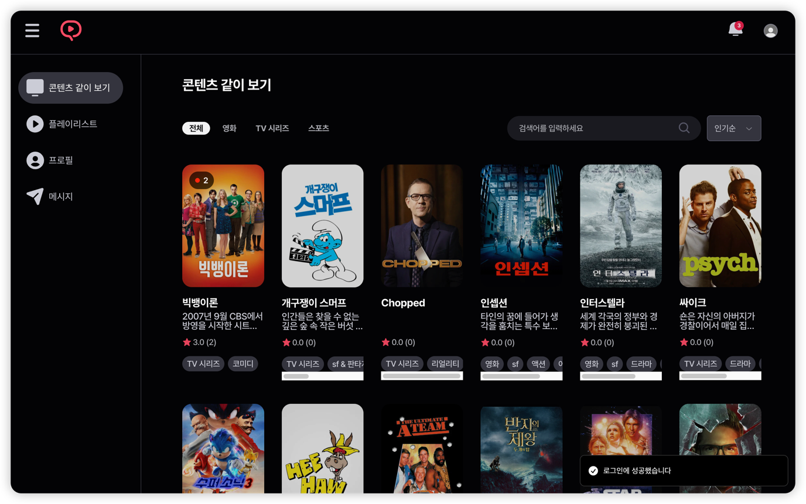<br/>

</details>

- **콘텐츠 관리**
  - 콘텐츠 생성/수정(멀티파트 썸네일 업로드)/조회/삭제(CRUD) API 구현
  - OpenSearch(nori 한국어 형태소) 기반 콘텐츠 검색과 캐시 조회 구현
- **외부 콘텐츠 수집**
  - TMDB(영화/TV), SportsDB(스포츠) 데이터를 WebClient로 수집하는 API 구현
  - Spring Batch 기반 대량 수집 및 스케줄러 주기 실행

### 이윤섭

<details>
<summary>📷 스크린샷</summary>

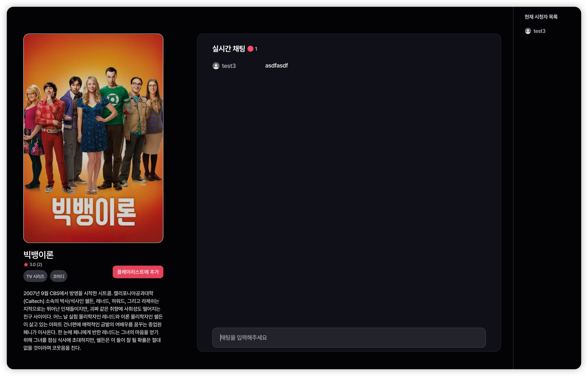<br/>
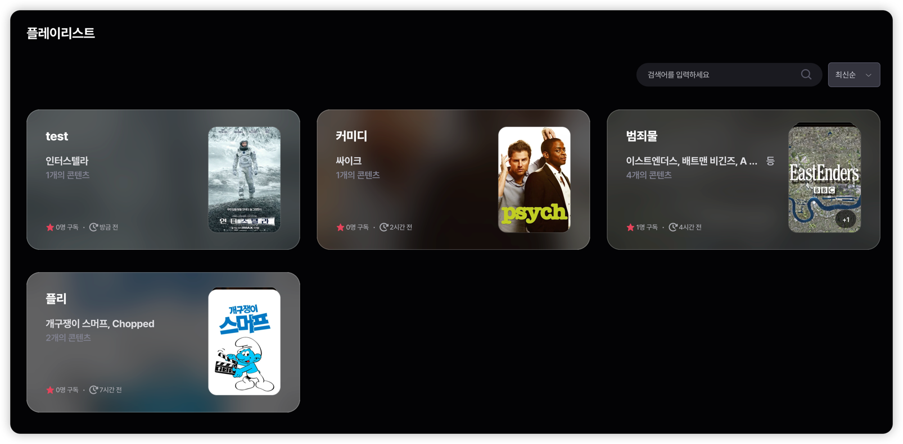<br/>
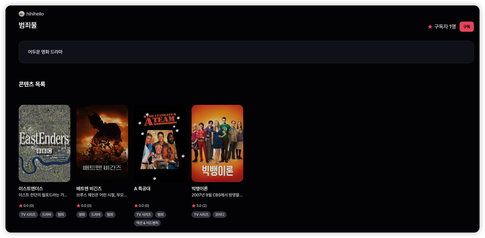<br/>

</details>

- **실시간 같이 보기**
  - WebSocket(STOMP) 기반 실시간 시청 세션과 채팅 구현
  - 콘텐츠별/사용자별 시청 세션 조회 API, Redis 기반 세션 관리
  - ShedLock 분산 락으로 만료 세션 정리 스케줄러 구현
- **STOMP / WebSocket**
  - STOMP 메시징 공통 구조 구현
- **플레이리스트**
  - 플레이리스트 생성/조회/수정/삭제(CRUD) API 구현
  - 플레이리스트에 콘텐츠 추가/제거 API 구현
  - 플레이리스트 구독/구독 취소 API 구현

<br>

## 파일 구조

```
mopl
┣━━ src/main/java/com/codeit/team5/mopl
┃   ┣━━ auth               # 인증/인가
┃   ┣━━ user               # 사용자/프로필
┃   ┣━━ content            # 콘텐츠 (TMDB/SportsDB 연동)
┃   ┣━━ playlist           # 플레이리스트
┃   ┣━━ watcher            # 실시간 같이 보기
┃   ┣━━ sse                # SSE 실시간 전송
┃   ┣━━ notification       # 알림
┃   ┣━━ review             # 리뷰
┃   ┣━━ follow             # 팔로우
┃   ┣━━ subscription       # 구독
┃   ┣━━ dm                 # 다이렉트 메시지
┃   ┣━━ tag                # 태그
┃   ┣━━ binarycontent      # 바이너리 콘텐츠
┃   ┣━━ config             # 설정
┃   ┗━━ global             # 공통 모듈
┣━━ infra/terraform        # AWS IaC (Terraform)
┣━━ monitoring             # Grafana, Prometheus
┣━━ data-generator         # 더미 데이터 생성기
┗━━ k6                     # 부하 테스트
```


<br>

## 프로젝트 발표 자료

_(제작한 발표자료 링크 혹은 첨부파일 첨부)_
